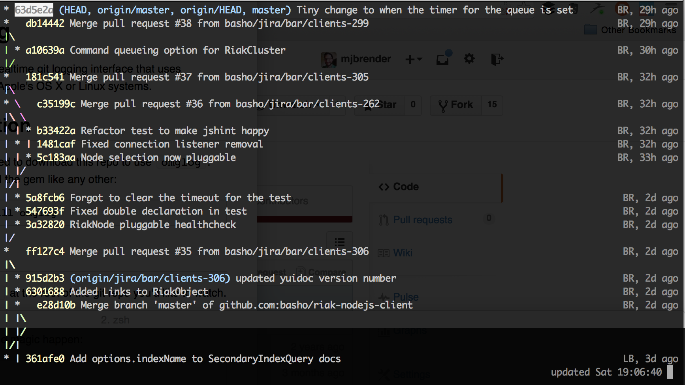

# omglog
A CLI-based git logging interface that uses fseventsd for Apple's OS X or Linux systems. Data updates live and resizes if you change your terminal size.

## Installation

There's no need to download this repo to use `omglog`. You can install the gem like any other: 

     gem install omglog

### Updates

New versions of `omglog` come up occasionally. Like any other gem, you should run: 

     gem update omglog

Or update it alongside all other gems: 

     gem update

## Usage

Run `omglog` at the root of the git repo you'd like to watch.

Just `cd` to whatever directory you want to see visualized and then let the magic happen: 

     $ omglog
     
You'll then see a real-time update of your commits and branches. For example: 

When you'd like to exit, use your CLI's escape command to do so. On most systems, this will be `control + C`.

## License and Authors
**omglog** is licensed under the BSD model. You can learn much more about it [here](http://www.linfo.org/bsdlicense.html). The full license file is under [LICENSE](LICENSE)

* Author: [Ben Hoskings](ben@hoskings.net)
